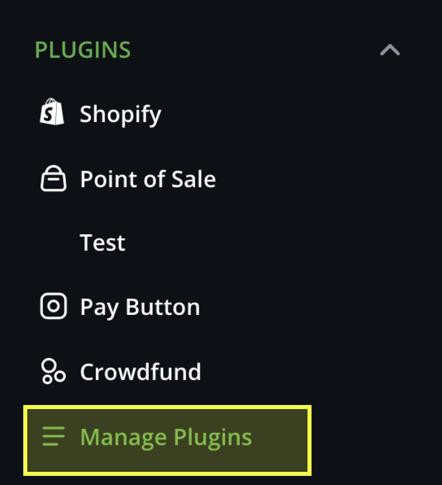
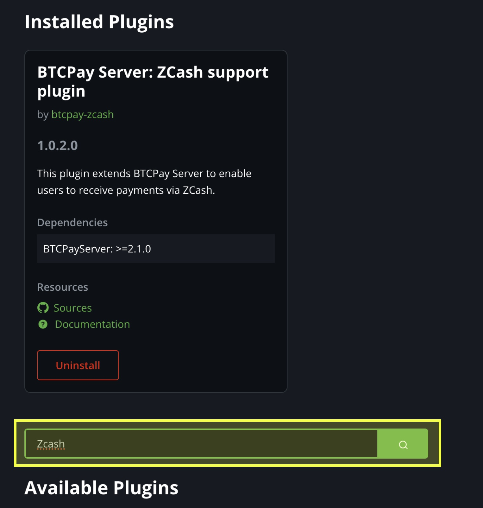
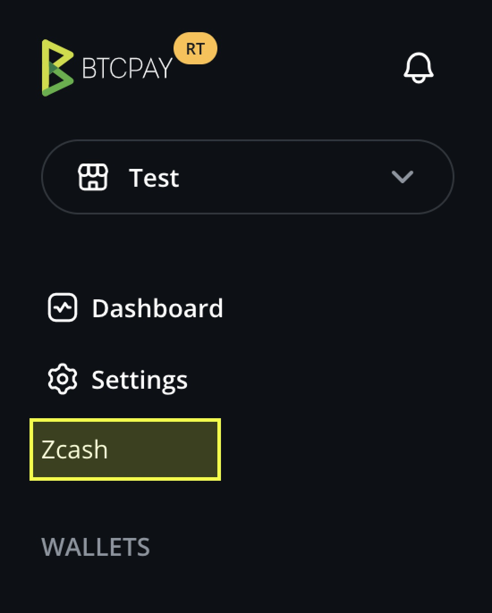
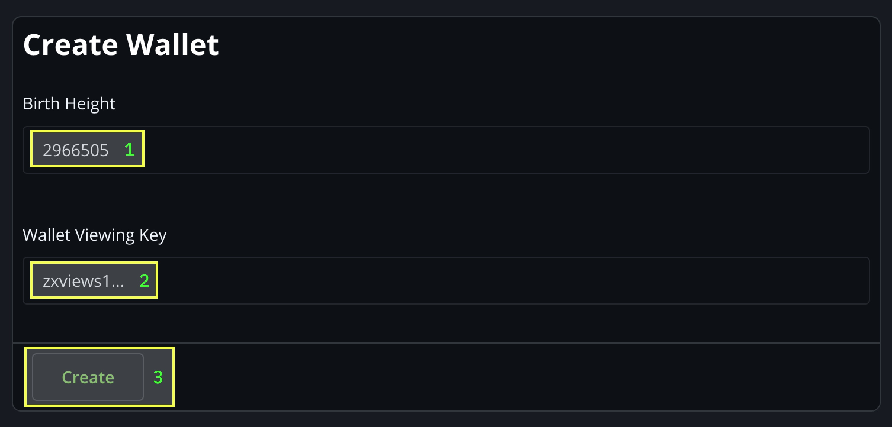
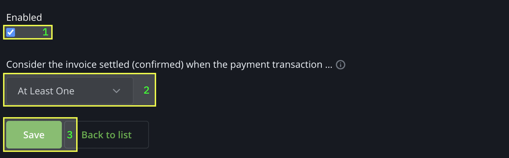

# Installation Instructions

<!-- For the official documentation, refer to [Full installation (for technical users) - docs.btcpayserver.org](https://docs.btcpayserver.org/Docker/#full-installation-for-technical-users) -->


```sh
mkdir BTCPayServer
cd BTCPayServer

# Clone the docker fragment repository
git clone https://github.com/btcpay-zcash/btcpayserver-docker
cd btcpayserver-docker
git checkout feat/zec

# Run btcpay-setup.sh with the right parameters
export BTCPAY_HOST="btcpay.example.com"
export NBITCOIN_NETWORK="mainnet"
export BTCPAYGEN_CRYPTO1="zec"
export BTCPAYGEN_ADDITIONAL_FRAGMENTS=""
export BTCPAYGEN_REVERSEPROXY="nginx"
. ./btcpay-setup.sh -i
```

## Existing BTCPayServer Instance

As root, run `. btcpay-setup.sh`; this will show you the environment variable it is expecting. For example, if you support `btc` and `ltc` already, and want to add `zec`:


**Example**

**`git checkout` into fork**

```sh
cd btcpayserver-docker
git checkout feat/zec
```

```sh
export BTCPAYGEN_CRYPTO3='zec'
. btcpay-setup.sh -i
```

## Setup Your (View-Only) Zcash Wallet

Use a mobile or desktop wallet such as YWallet or Zingo, that supports a Viewing Key export.


## Install and Setup Zcash Plugin









